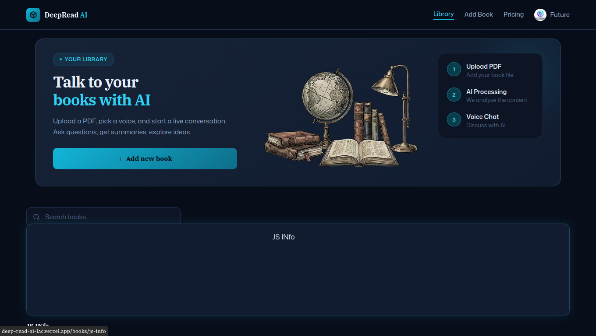

<div align="center">
  <br />
    <a href="https://deep-read-ai-lac.vercel.app/" target="_blank">
      
    </a>
  <br />

  <div>


<br/>


  </div>

  <h3 align="center">DeepRead — AI Book Companion</h3>

  <div align="center">
    Feel free to fork this repo as a starter template. A ⭐ is appreciated if you find it useful!
  </div>
</div>

---

## Table of Contents

1. [Introduction](#introduction)
2. [Tech Stack](#tech-stack)
3. [Features](#features)
4. [Quick Start](#quick-start)

---

## <a name="introduction">✨ Introduction</a>

**DeepRead** is an AI-powered platform for having real-time voice conversations with your books. Upload a PDF, pick an ElevenLabs voice persona, and talk to your library — ask questions, request summaries, and follow along with live transcripts. Built with Next.js 16, Vapi, MongoDB, and Clerk.

---

## <a name="tech-stack">⚙️ Tech Stack</a>

| Technology | Role |
|---|---|
| [Next.js 16](https://nextjs.org/docs) | Core framework — handles routing, SSR, and API routes |
| [Vapi](https://vapi.ai/) | Real-time voice AI engine for low-latency conversations |
| [ElevenLabs](https://elevenlabs.io/docs) | Lifelike TTS powering voice persona previews and synthesis |
| [Clerk](https://clerk.com/) | Authentication — email/social login and session management |
| [MongoDB](https://www.mongodb.com/docs/) + Mongoose | Stores user libraries, book metadata, and transcripts |
| [TypeScript](https://www.typescriptlang.org/) | Static typing for maintainability and error safety |
| [Tailwind CSS](https://tailwindcss.com/) + [Shadcn UI](https://ui.shadcn.com/) | Accessible, themeable component-based UI |
| [CodeRabbit](https://www.coderabbit.ai/) | AI code review for PR feedback and quality checks |

---

## <a name="features">🔋 Features</a>

- **PDF Upload & Ingestion** — Automated text extraction, chunking, and embedding for precise context retrieval.
- **Voice Conversations** — Real-time, back-and-forth verbal interaction with your books via Vapi.
- **AI Voice Personas** — Pick from multiple ElevenLabs personalities with instant high-fidelity previews.
- **Smart Summaries** — Ask for chapter summaries or deep-dives on any topic from your content.
- **Session Transcripts** — Auto-generated text records of every conversation, always accessible.
- **Library Management** — Organize personal uploads or browse the global collection with fast search.
- **Auth & Subscriptions** — Secure login paired with billing for premium feature access.

---

## <a name="quick-start">🤸 Quick Start</a>

**Prerequisites:** Git, Node.js, and npm installed.

```bash
# Clone and install
git clone https://github.com/Sid2169/DeepReadAI.git
cd DeepReadAI
npm install
```

**Environment Variables**

Create a `.env` file in the project root:

```env
NODE_ENV='development'
NEXT_PUBLIC_BASE_URL=

# CLERK
NEXT_PUBLIC_CLERK_PUBLISHABLE_KEY=
CLERK_SECRET_KEY=
NEXT_PUBLIC_CLERK_SIGN_IN_URL=/sign-in
NEXT_PUBLIC_CLERK_SIGN_UP_URL=/sign-up
NEXT_PUBLIC_CLERK_SIGN_IN_FALLBACK_REDIRECT_URL=/
NEXT_PUBLIC_CLERK_SIGN_UP_FALLBACK_REDIRECT_URL=/

# VERCEL BLOB
BLOB_READ_WRITE_TOKEN=

# MONGODB
MONGODB_URI=

# VAPI
NEXT_PUBLIC_VAPI_API_KEY=
VAPI_SERVER_SECRET=

# GOOGLE GEMINI (embeddings)
GOOGLE_GEMINI_API_KEY=

# ELEVENLABS
ELEVENLABS_API_KEY=
```

Get your credentials from: [Clerk](https://clerk.com) · [Vercel](https://vercel.com) · [MongoDB](https://www.mongodb.com) · [Vapi](https://vapi.ai) · [Google AI Studio](https://aistudio.google.com) · [ElevenLabs](https://elevenlabs.io)

```bash
npm run dev
```

Visit [http://localhost:3000](http://localhost:3000) to view the app.

---

<div align="center">
  <p>Built with ❤️ using Next.js, Vapi, and ElevenLabs.</p>
  <p>If this project helped you, please consider giving it a ⭐ — it goes a long way!</p>
</div>